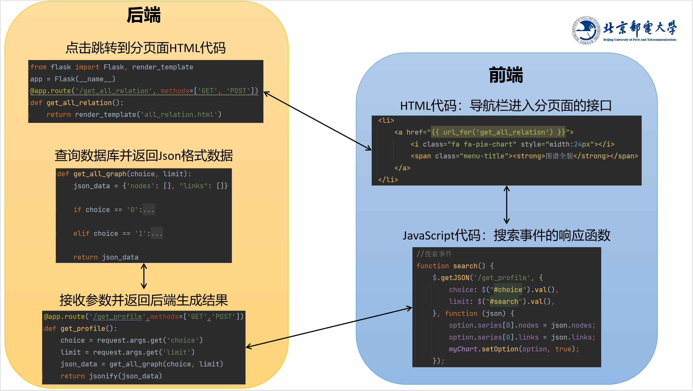

# 基于金融知识图谱的知识计算引擎构建

前端代码参考[KGQA_HLM：基于知识图谱的《红楼梦》人物关系可视化及问答系统](https://github.com/chizhu/KGQA_HLM)

多轮对话机制参考[基于金融知识图谱的问答系统](https://github.com/XuekaiChen/FinKnowledgeGraph)

## 项目主图

封面

检索节点信息

图谱全貌

多轮对话

程序流

## 准备数据
1. 利用结构化三元组构建金融知识图谱，数据可在[此处](https://pan.baidu.com/s/1UQfu5c1Y7BfdMS_uNGrZug )下载获得，提取码：`sae3`
2. 依照[此项目](https://github.com/XuekaiChen/FinKnowledgeGraph)中的中“2.安装环境”的提示，下载Neo4j
     * 创建Project：finance_demo
     * 在Project下创建数据库：db
     * 用户名：neo4j
     * 密码：neo4j123
3. 下载该项目中的`step2_store_to_neo4j.py`文件，运行生成后端金融知识图谱

## 运行
1. 开启Neo4j数据库finance_demo/db（默认7474端口）
2. 运行`app.py`主程序，点击生成的网址链接（默认5000端口）

### 项目结构如下：

